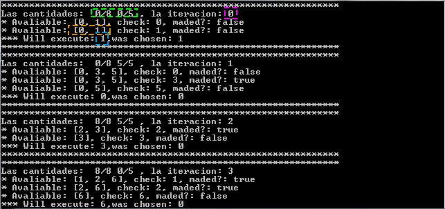

# CuboSolver
Este programa resuelve el problema de cubos de agua (u otros liquidos). Estos problemas consiste en lograr una
cantidad de liquido determinada en un de los recipientes mediante operaciones de llenado, vaciado y transferencia
de liquido de un recipiente a otro. Este tipo de problemas se utilizan como puzzles para desarrolar el intelecto.
Un ejemplo es el de la pelicula "Duro de Matar".
## Arranque del programa
Para ejecutar el programa abrir el archivo **run.bat**
También se puede abrir usando la consola(cmd). Para ello debemos ejecutar el comando:<br/>
`java -jar CuboSolver.jar` <br/>
Recuerda estar situado en el directorio _dist_ antes de ejecutar el comando.
## Funcionamiento del programa
### Situación inicial
Lo primero que necesita el programa son los datos iniciales para poder trabajar:

1. Numero de cubos
2. Capacidad y cantidad de cada uno
3. Meta, cantidad de liquido que se desea al final.

Los dos primeros (1. y 2.) apartados se cubren en el menu **editar cubos**.
El ultimo apartado, la meta, se establece en el menu **resolver**.
### Resolver
El programa para resolver el problema sigue el siguiente esquema:

1. Comprueba la meta, si las cantidades de los cubos son las deseadas.
2. Si no, continua y comprueba que operadores se pueden hacer
3. Quita operadores que den a situaciones anteriores, es decir, el programa va guardando un historial de las cantidades de cada cubo,
y escogerá los operadores que llevan los cubos a contener cantidades que no se encuentran en el historial. Ver el siguiente apartado operadores.
3. Escoge un operador de los disponibles al azar.

### Operadores
Los operadores por cada cubo son:

1. Llenar el cubo por completo
2. Vaciar el cubo por completo
3. Llenar un cubo con el liquido de otro
4. Vaciar un cubo en otro

Los operadores "1" y "2" solo afectan a un cubo. Los operadores "3" y "4" afectan a dos cubos. La diferencia entre el op "3" y "4" es que en el 
operador 3 el cubo que suministra el agua no se vacia del todo. El operador "4" consiste en coger un cubo y vaciar todo el contenido en otro.
Por lo tanto si tenemos 3 cubos tenemos 10 operadores en total. <br/>
### Operadores disponibles
Pero los operadores disponibles nuncan son los totales, ya que dependen de la situación (de las cantidades) en que se encuentre los cubos.
Por ejemplo si el cubo esta llenado no podemos volver a llenarlo por lo que el operador llenar no estará disponible en ese momento.
### Operadores activos
Para evitar bucles infinitos, el programa descarta de entre los operadores disponibles aquellos que una vez ejecutados, devuelvan los
cubos a una situación anterior. Para ello el programa guarda un historial de situaciones.
```
Por ejemplo si tenemos un cubo de 8 litros y de 2 llenos hasta la mitad la situación inicial sería 4/8 y 1/2 
(cantidad/capacidad). Un operador sería llenar el primer cubo, lo ejecutamos y la situación sería 8/8 y 1/2.
Luego ejecutamos el operador vaciar, y tenemos 0/8 y 1/2. Si quisieramos ahora llenar el cubo de 8 de nuevo
el programa no nos dejaría, ya que se repetiria la situación 8/8 y 1/2.
```
## Entender los resultados
El programa imprime los resultados que va obteniendo en las diferentes iteraciones. Hasta que el programa llega a la meta o llega a la iteración 100.
Me pareció absurdo que el programa realizase más iteraciones, si se necesita mas de 100 iteraciones el problema no tiene
ningún sentido práctico.<br/>
Fijemonos en la imagen de abajo:<br/>
<br/>
En **verde** tenemos la situación actual, capacidad/cantidad.<br/>
En **rosa** la iteración actual.<br/>
En **naranja** los operadores disponibles. Siguiendo el orden expuesto anteriormente el op "0" es llenar el 1º cubo y el "1" es llenar el cubo 2º.
A continuación se puede ver la comprobación de si el operador devuelve a una situación anterior (maded?).<br/>
En **azul** finalmente el operador escogido.

